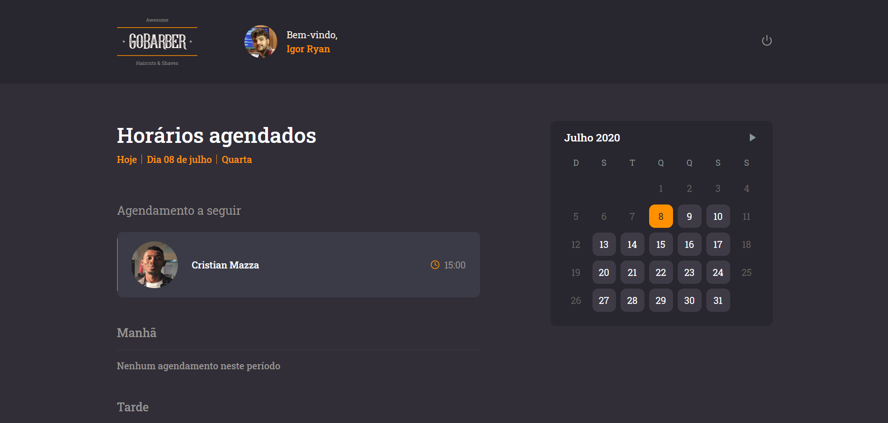

<h1 align="center"></h1>

<div align="center">

[Back-end](#back-end-em-nodejs) | [Front-end Web](#front-end-em-reactjs) | [Mobile](#mobile-em-react-native)

</div>
<h1 align="center"></h1>


## Back-end em Node.js

Responsável por intermediar as requisições aos bancos de dados e fornecer retorno em JSON para o front-end web e mobile. Além de enviar e-mail's e tratar de toda regra de negócio.

#### Principais utilizações:

- Typescript
- TypeORM
- Redis
- MongoDB
- AWS S3 Storage
- AWS Email Service
- BCrypt
- Date-fns
- Class-transformer
- Nodemailer
- Multer
- Jest

## Front-end em ReactJS

<h4 align="center">



</h4>

## Mobile em React Native

<h4 align="center">

</h4>

# Configurando o projeto
Faça o clone do projeto:
  ```
  git clone https://github.com/Igorryan/gobarber
  ```

## Iniciando a API Node.js (back-end)

1. Entre na pasta "beckend" e pelo terminal, instale as dependências com o comando:
```
yarn
```
2. Crie um arquivo "ormconfig.json" e configure os bancos:
```json
[
  {
    "name": "default",
    "type": "postgres",
    "host": "localhost",
    "port": "5432",
    "username": "postgres",
    "password": "igorryan",
    "database": "gostack_gobarber",
    "entities": [
      "src/modules/**/infra/typeorm/entities/*.ts"
    ],
    "migrations": ["src/shared/infra/typeorm/migrations/*.ts"],
    "cli": {
        "migrationsDir": "src/shared/infra/typeorm/migrations"
    }
  },
  {
    "name": "mongo",
    "type": "mongodb",
    "host": "localhost",
    "port": "27017",
    "database": "gostack_gobarber",
    "useUnifiedTopology": true,
    "entities": [
      "src/modules/**/infra/typeorm/schemas/*.ts"
    ]
  }
]
```
3. Preencha as variáveis do arquivo ".env.example" com as suas credenciais e renomei-o para ".env"

| Variável | Funcionalidade |
| ------ | ----------- |
| APP_SECRET   | Um conjunto de caracteres que serve para a criptografia das senhas. |
| MAIL_DRIVER   | Define qual serviço de e-mail da aplicação, atualmente pode ser setada como <strong>ethereal</strong> ou <strong>ses</strong> |
| AWS_ACCESS_KEY_ID   | Chave de acesso da conta AWS |
| AWS_SECRET_ACCESS_KEY   | Segredo de acesso da conta AWS  |
| STORAGE_DRIVER   | Define qual serviço armazenamento (storage) da aplicação, atualmente pode ser setada como <strong>disk</strong> ou <strong>s3</strong> |

4. Execute as migrations com o comando:
```
yarn typeorm migration:run
```
5. Por último, execute o comando abaixo para iniciar a API:
```
yarn dev:server
```

## Iniciando a Aplicação Web (front-end)

1. Entre na pasta "frontend"
2. Instale as dependências com o comando:
```
yarn
```
3. Execute o projeto com 
```
yarn start
```

Lembre-se de estar com a API em execução.

## Iniciando a Aplicação Mobile (mobile)

1. Entre na pasta "mobile"
2. Instale as dependências com o comando:
```
yarn
```
3. Execute o projeto com 
```
yarn android ou yarn ios ou npx react-native run-android
```

Lembre-se de estar com a API em execução.
<div align="center">
  <sub>Built with ❤︎ by <a href="https://www.linkedin.com/in/igorryan/">Igor Ryan</a>
</div>
